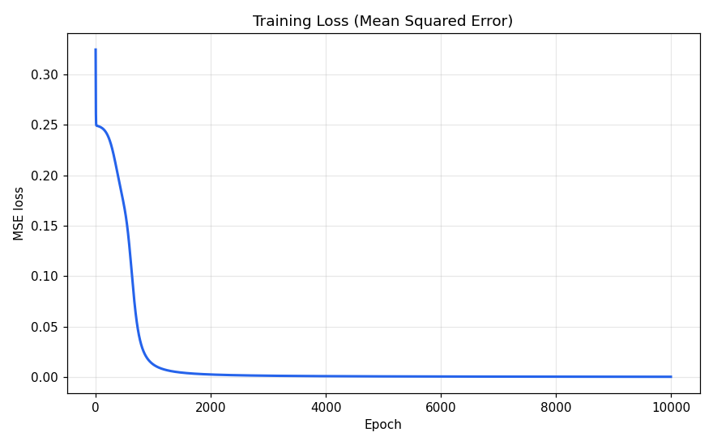
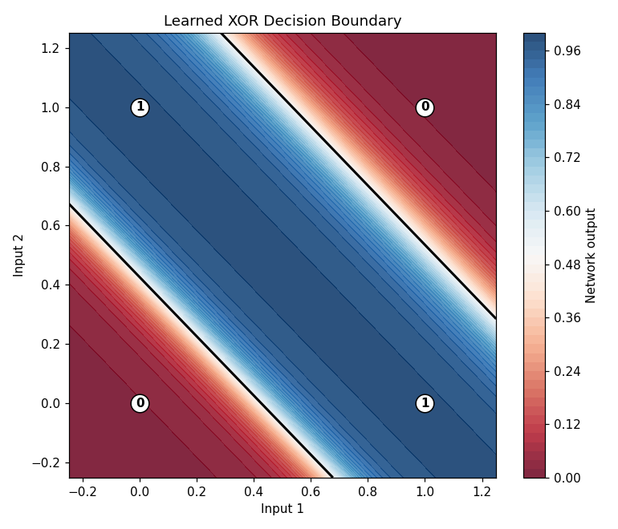

# XOR Problem — Neural Network from Scratch with Backpropagation

[](https://www.python.org/)
[](https://numpy.org/)
[](https://jupyter.org/)
[](LICENSE)

A clean, from-scratch implementation of a small feed-forward **neural network** trained with
**backpropagation** to learn the classic **XOR** function — using nothing but
[NumPy](https://numpy.org/).

XOR ("exclusive or") is the textbook example of a problem a single-layer perceptron *cannot*
solve, because the two classes are **not linearly separable**. Adding one hidden layer with a
non-linear activation is enough to solve it, which makes XOR the "hello world" of multi-layer
neural networks.

---

## Table of contents

- [The problem](#the-problem)
- [Network architecture](#network-architecture)
- [Results](#results)
- [Project structure](#project-structure)
- [Getting started](#getting-started)
- [Usage](#usage)
- [How it works](#how-it-works)
- [Next steps](#next-steps)
- [License](#license)

## The problem

The XOR function returns `1` only when its two inputs **differ**:

| Input 1 | Input 2 | XOR output |
|:-------:|:-------:|:----------:|
|    0    |    0    |     0      |
|    0    |    1    |     1      |
|    1    |    0    |     1      |
|    1    |    1    |     0      |

The two `1`s and the two `0`s sit on opposite diagonals, so no single straight line can separate
them. A hidden layer lets the network bend its decision surface into the non-linear shape
required.

## Network architecture

```
Input layer        Hidden layer        Output layer
 (2 units)   --->   (2 units, sigmoid)   --->   (1 unit, sigmoid)
```

- **Loss:** mean squared error (MSE)
- **Optimizer:** vanilla gradient descent
- **Learning rate:** `0.5`
- **Epochs:** `10,000`

## Results

After training, the network reaches **100% accuracy** on the XOR truth table, with outputs
collapsing toward the correct `0`/`1` targets.

| Input  | Target | Network output |
|:------:|:------:|:--------------:|
| (0, 0) |   0    |     ~0.02      |
| (0, 1) |   1    |     ~0.98      |
| (1, 0) |   1    |     ~0.98      |
| (1, 1) |   0    |     ~0.02      |

<table>
  <tr>
    <td align="center"><b>Training loss</b></td>
    <td align="center"><b>Learned decision boundary</b></td>
  </tr>
  <tr>
    <td></td>
    <td></td>
  </tr>
</table>

The decision-boundary plot shows the non-linear region the network learns to carve out — exactly
what is needed to separate the XOR classes.

## Project structure

```
.
├── XOR Problem using Backpropagation in Neural Network.ipynb  # Annotated walkthrough
├── xor_backprop.py        # Standalone script version (no Jupyter required)
├── assets/                # Generated plots used in this README
├── requirements.txt       # Python dependencies
├── LICENSE                # MIT license
└── README.md
```

## Getting started

### Prerequisites

- Python 3.8 or newer

### Installation

```sh
# Clone the repository
git clone https://github.com/rajeshwar-vempaty/XOR_Problem.git
cd XOR_Problem

# (Recommended) create and activate a virtual environment
python -m venv .venv
source .venv/bin/activate        # On Windows: .venv\Scripts\activate

# Install dependencies
pip install -r requirements.txt
```

## Usage

### Run the standalone script

```sh
python xor_backprop.py
```

This trains the network, prints the results table, and saves the loss and decision-boundary
plots to the `assets/` folder.

### Explore the notebook

```sh
jupyter notebook "XOR Problem using Backpropagation in Neural Network.ipynb"
```

The notebook walks through the dataset, the sigmoid activation, the network class, training, and
the visualizations step by step.

## How it works

1. **Forward pass** — inputs flow through the hidden and output layers, each applying a weighted
   sum followed by the sigmoid activation.
2. **Loss** — the mean squared error between predictions and targets is computed.
3. **Backpropagation** — gradients are propagated backward using the chain rule (the sigmoid's
   derivative is conveniently `a * (1 - a)`).
4. **Weight update** — weights and biases are nudged in the direction that reduces the loss.
5. **Repeat** — steps 1–4 run for many epochs until the loss converges near zero.

## Next steps

- Swap the sigmoid for **ReLU** or **tanh** and compare convergence.
- Replace MSE with **binary cross-entropy** loss.
- Add more hidden units/layers and observe how the decision boundary changes.
- Experiment with the **learning rate** and number of **epochs**.

## License

This project is licensed under the terms of the [MIT License](LICENSE).
